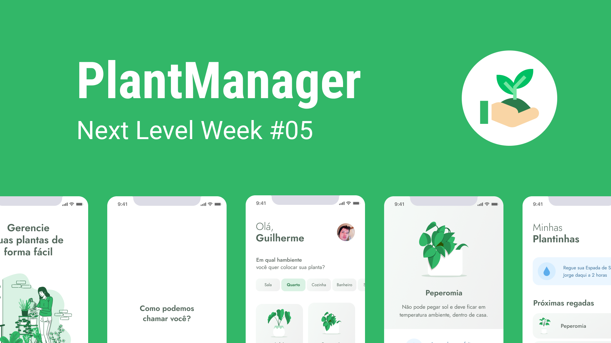

 

 
<a href="https://github.com/gsbenevides2/nlw-05-plantmanager/releases/tag/1.0.0">Clique aqui para download</a>

Projeto de desenvolvido durante a <a href="https://nextlevelweek.com">Next Level Week 5</a> da <a href="https://github.com/rocketseat">@rocketseat.</a> Um app para lembrar do horário de regar às plantas.

  

<h2>👨‍💻 Tecnologias</h2>
<ul>
<li>Expo</li>
<li>Typescript</li>
<li>React Native</li>
</ul>
<h3>📚 Bibliotecas</h3>
<ul>
<li>Styled Components: Estilização</li>
<li>Push Notifications: Notificações</li>
<li>Async Storage: Armazenamento local</li>
<li>Vector Icons: Ícones</li>
<li>DateTimePicker: Seleção de data e hora</li>
<li>React Navigation: Navegação entre Telas</li>
<li>Lottie: Animações</li>
<li>Expo Google Fonts: Fontes</li>
</ul>

<h2>🏃 Como rodar</h2>
<ol>
<li>Faça um clone desse repositório</li>
<li>Instale as dependências usando o Yarn</li>
<li>Rode o <pre>yarn start</pre></li>
</ol>

<h2>📲 Download</h2>

Por questões técnicas, o download da aplicação está disponível somente para android e fora da Google Play Store. Lembre-se de habilitar a instalação de aplicativos de fontes desconhecidas.

Use o <a href="https://github.com/gsbenevides2/nlw-05-plantmanager/releases/tag/1.0.0"> link</a> para fazer download do APK.

<h2>🔗 Links</h2>
<ul>
<li><a href="https://gui.dev.br/blog/post/uma-semana-puxada-por%C3%A9m-incr%C3%ADvel-%F0%9F%9A%80">Ver publicação no Blog.</a></li>
<li><a href="https://github.com/gsbenevides2/nlw-05-server">Código do servidor fake que fornece as informações sobre as plantas.</a></li>
<li><a href="https://www.figma.com/file/WscOhp32wfbuWSDhVsYiE5/PlantManager?type=design&node-id=0%3A1&mode=design&t=XFOeaD2keaVB8xoH-1">Prototipagem do Projeto no Figma</a></li>
</ul>

<h2>📃 Licença</h2>

Este projeto está sobre a licença MIT. Veja ela em: <a href="LICENSE">LICENSE</a>.

Feito com 💚 por <a href="https://gui.dev.br">gsbenevides2</a><b>
